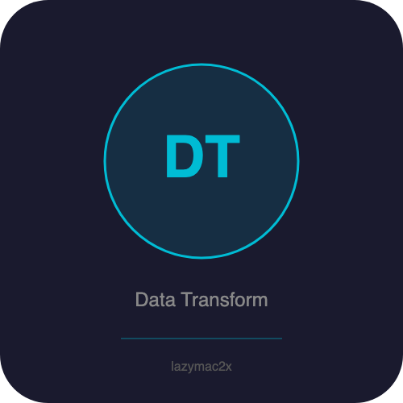

<p align="center"></p>

[](https://lazymac2x.github.io/lazymac-api-store/) [](https://coindany.gumroad.com/) [](https://mcpize.com/mcp/data-transform-api)

# data-transform-api

> ⭐ **Building in public from $0 MRR.** Star if you want to follow the journey — [lazymac-mcp](https://github.com/lazymac2x/lazymac-mcp) (42 tools, one MCP install) · [lazymac-k-mcp](https://github.com/lazymac2x/lazymac-k-mcp) (Korean wedge) · [lazymac-sdk](https://github.com/lazymac2x/lazymac-sdk) (TS client) · [api.lazy-mac.com](https://api.lazy-mac.com) · [Pro $29/mo](https://coindany.gumroad.com/l/zlewvz).

[](https://www.npmjs.com/package/@lazymac/mcp)
[](https://smithery.ai/server/lazymac/mcp)
[](https://coindany.gumroad.com/l/zlewvz)
[](https://api.lazy-mac.com)

> 🚀 Want all 42 lazymac tools through ONE MCP install? `npx -y @lazymac/mcp` · [Pro $29/mo](https://coindany.gumroad.com/l/zlewvz) for unlimited calls.

Data transformation API — convert between JSON, CSV, XML. Flatten, filter, sort, pick fields, compute stats, and validate data. Zero dependencies beyond Express.

## Quick Start

```bash
npm install && npm start  # http://localhost:3600
```

## Endpoints

### Convert
```bash
# JSON → CSV
curl -X POST http://localhost:3600/api/v1/json-to-csv \
  -H "Content-Type: application/json" \
  -d '{"data": [{"name":"Alice","age":30},{"name":"Bob","age":25}]}'

# CSV → JSON
curl -X POST http://localhost:3600/api/v1/csv-to-json \
  -H "Content-Type: application/json" \
  -d '{"csv": "name,age\nAlice,30\nBob,25"}'

# JSON → XML
curl -X POST http://localhost:3600/api/v1/json-to-xml \
  -H "Content-Type: application/json" \
  -d '{"data": {"user": {"name": "Alice", "age": 30}}, "rootName": "response"}'
```

### Transform
```bash
# Flatten nested JSON
curl -X POST http://localhost:3600/api/v1/flatten \
  -H "Content-Type: application/json" \
  -d '{"data": {"user": {"name": "Alice", "address": {"city": "Seoul"}}}}'
# → {"user.name": "Alice", "user.address.city": "Seoul"}

# Unflatten
curl -X POST http://localhost:3600/api/v1/unflatten \
  -H "Content-Type: application/json" \
  -d '{"data": {"user.name": "Alice", "user.age": 30}}'

# Filter (supports >, <, !)
curl -X POST http://localhost:3600/api/v1/filter \
  -H "Content-Type: application/json" \
  -d '{"data": [{"name":"Alice","age":30},{"name":"Bob","age":25}], "query": {"age": ">26"}}'

# Pick specific fields
curl -X POST http://localhost:3600/api/v1/pick \
  -H "Content-Type: application/json" \
  -d '{"data": [{"name":"Alice","age":30,"email":"a@b.c"}], "fields": ["name","age"]}'

# Sort
curl -X POST http://localhost:3600/api/v1/sort \
  -H "Content-Type: application/json" \
  -d '{"data": [{"name":"Bob","age":25},{"name":"Alice","age":30}], "field": "name"}'

# Stats
curl -X POST http://localhost:3600/api/v1/stats \
  -H "Content-Type: application/json" \
  -d '{"data": [{"score":85},{"score":92},{"score":78}], "field": "score"}'
# → {"count":3, "sum":255, "mean":85, "min":78, "max":92, "median":85}

# Validate JSON
curl -X POST http://localhost:3600/api/v1/validate \
  -H "Content-Type: application/json" \
  -d '{"data": {"valid": true}}'
```

## License

MIT

<sub>💡 Host your own stack? <a href="https://m.do.co/c/c8c07a9d3273">Get $200 DigitalOcean credit</a> via lazymac referral link.</sub>
